<h1 align="center">
  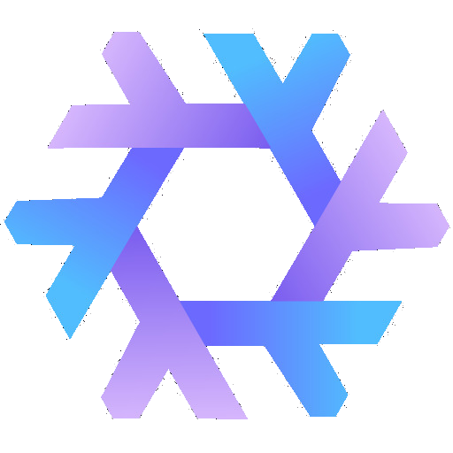
  <br>
  NixOS for a Lightweight & Beautiful Setup
  <br>
  
</h1>

## 🎉 Big THANK YOU!

A huge shoutout to my amazing buddies:

- [Nemnix](https://github.com/NemNix/Dotfiles) 🎩✨
- [Gurjaka](https://github.com/Gurjaka/Dotfiles) 🚀🔥

Your contributions and support mean the world! 🙌

## Sway
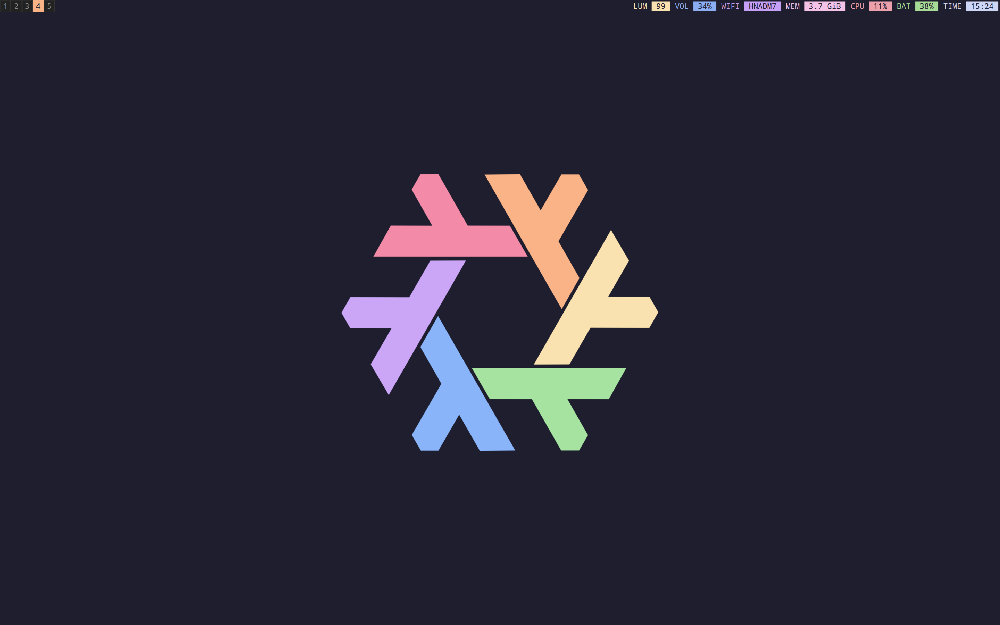

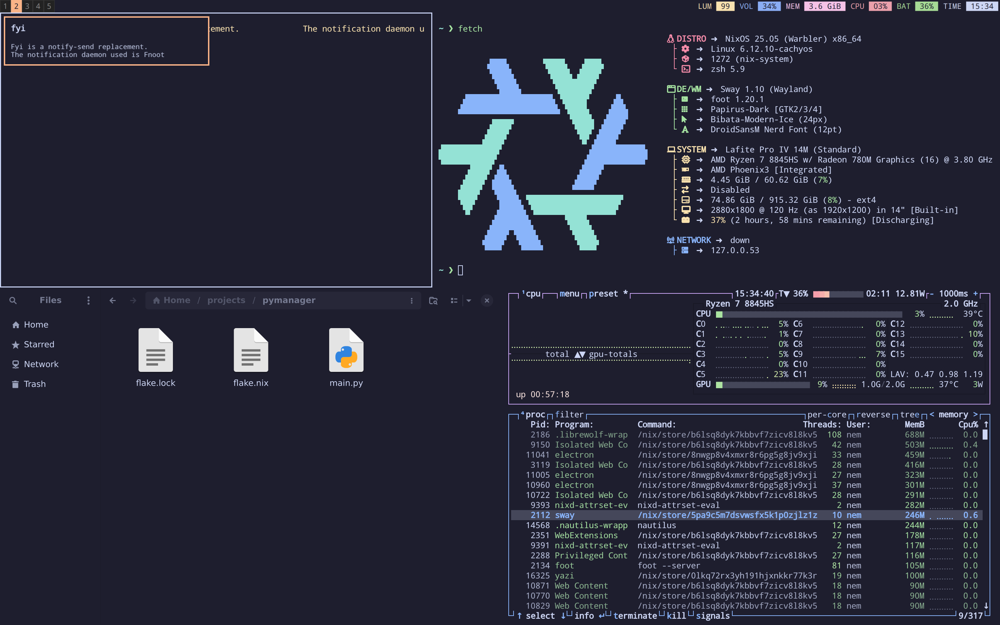
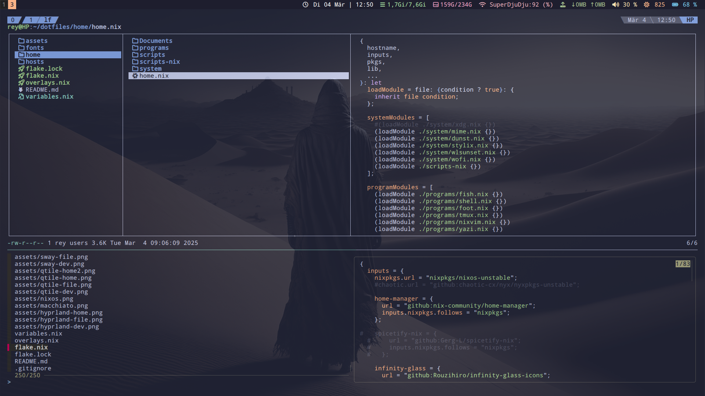

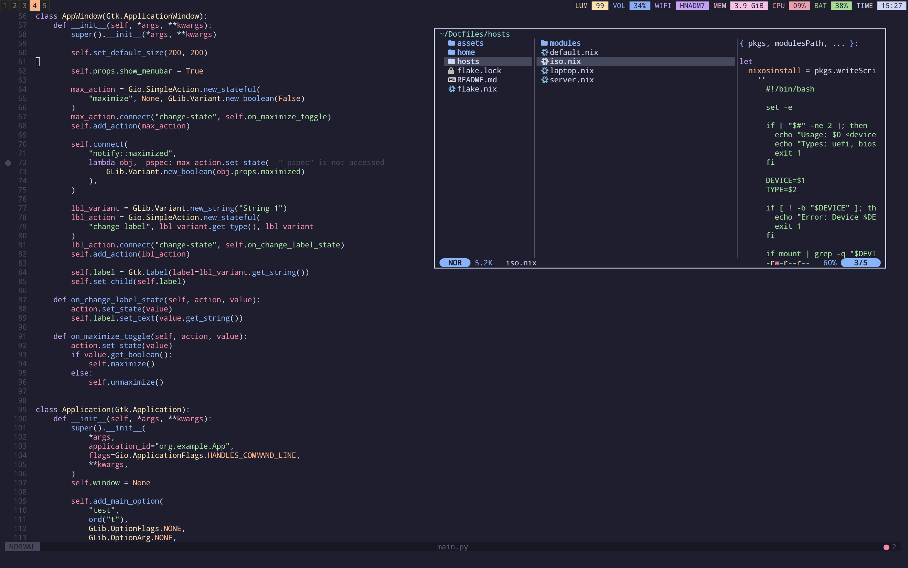
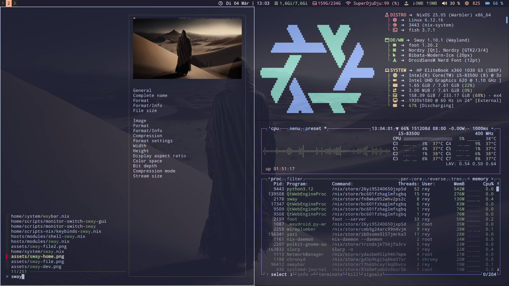

## Hyprland
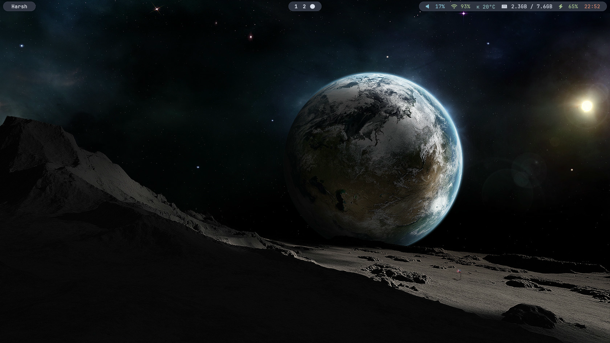

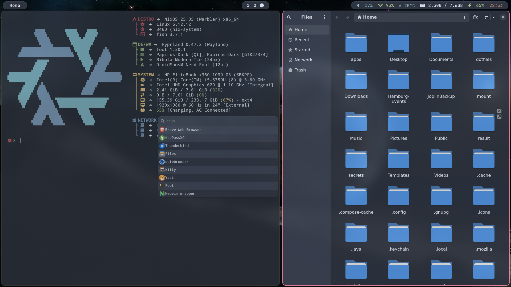

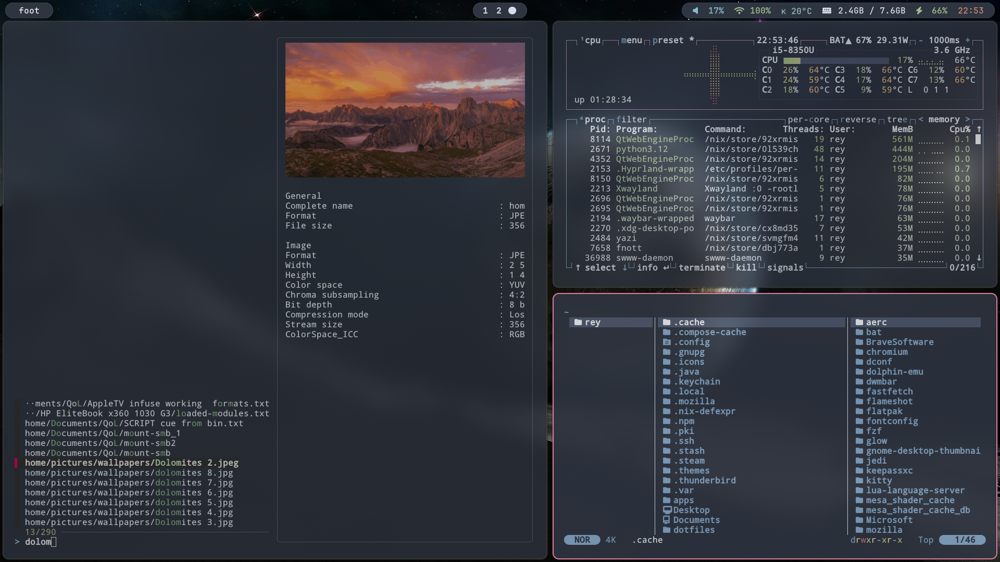


## Qtile
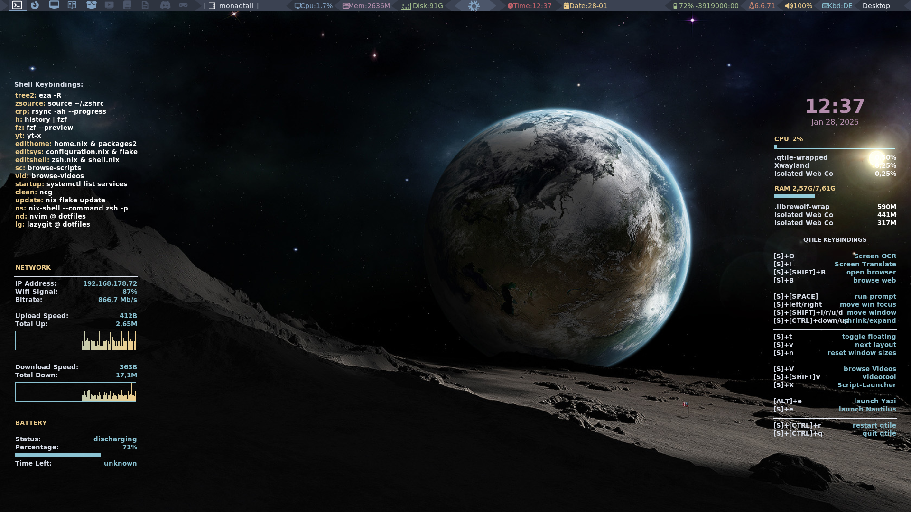

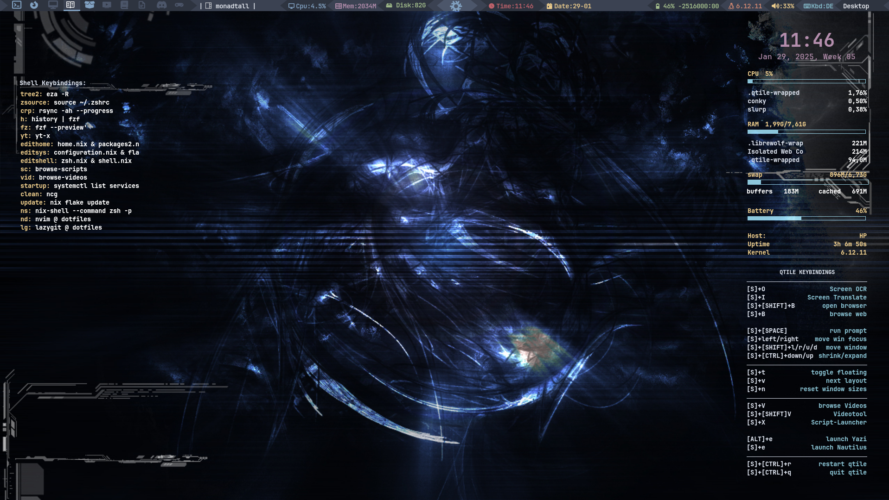

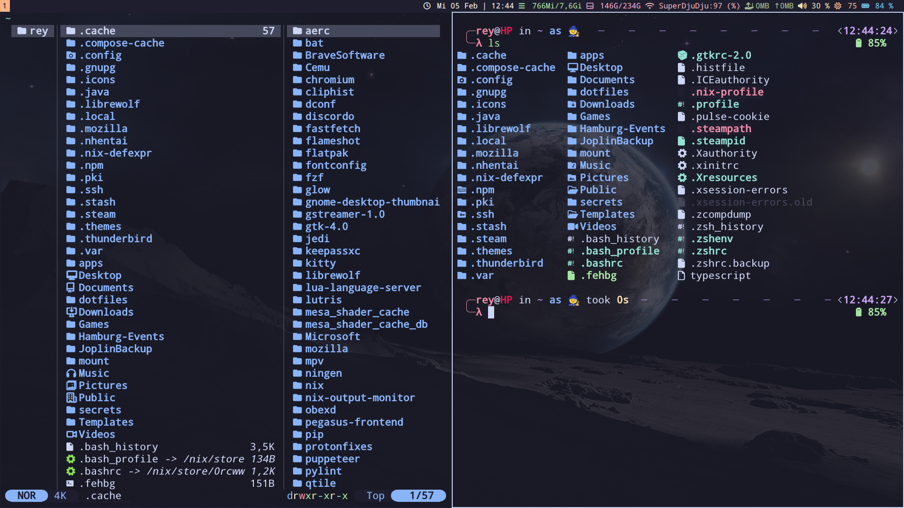

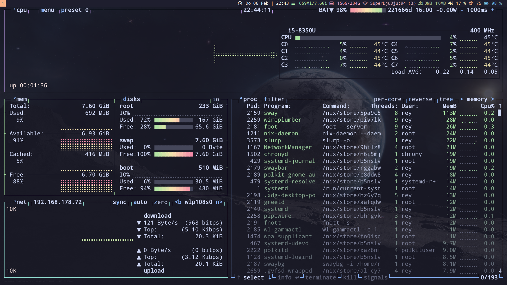

# Core System
- **Shell:** `fish`
- **Distro:** NixOS Unstable
- **Kernel:** default kernel 

## Window Managers

### Hyprland Ecosystem
| Component | Description | Language |
|-----------|-------------|------------|
| [Hyprland](https://github.com/hyprwm/Hyprland) | Window Manager | ![C++][cpp] |
| [Hyprlock](https://github.com/hyprwm/hyprlock) | Screen locker | ![C++][cpp] |
| [Hypridle](https://github.com/hyprwm/hypridle) | Idle daemon | ![C++][cpp] |
| [Hyprshot](https://github.com/Gustash/Hyprshot) | Screenshot tool | ![Shell][sh] |
| [Hyprpaper](https://github.com/hyprwm/hyprpaper) | Wallpaper manager | ![C++][cpp] |
| [Hyprpicker](https://github.com/hyprwm/hyprpicker) | Color picker | ![C++][cpp] |
| [Waybar](https://github.com/Alexays/Waybar) | Wayland Status Bar | ![C++][cpp] |


### Sway Ecosystem
| Component | Description | Language |
|-----------|-------------|------------
| [Sway](https://github.com/swaywm/sway) | Window Manager | ![C][c] |
| [Swaybg](https://github.com/swaywm/swaybg) | Wallpaper manager | ![C][c] |
| [Swaylock](https://github.com/swaywm/swaylock) | Screen locker | ![C][c] |
| [Swayidle](https://github.com/swaywm/swayidle) | Idle management | ![C][c] |
| [I3status](https://github.com/i3/i3status) | Status Bar for Sway/i3 | ![C][c] |
| [i3blocks](https://github.com/vivien/i3blocks) | Status Bar for Sway/i3 | ![C][c] |

### System Components
| Component | Description | Language |
|-----------|-------------|-----------|
| [Tuigreet](https://github.com/apognu/tuigreet) | Login Manager | ![Rust][rs] |
| [Tmux](https://github.com/tmux/tmux) | Terminal Multiplexer | ![C][c] |
| [Starship](https://github.com/starship/starship) | Cross-Shell Prompt | ![Rust][rs] |
| [Dunst](https://dunst-project.org/) | Notification Daemon | ![C][c] |
| [Fnott](https://codeberg.org/dnkl/fnott) | Notification Daemon | ![C][c] |
| [Wofi](https://gitlab.com/dgirault/wofi) | Application Launcher | ![C][c] |
| [Anyrun](https://github.com/anyrun-org/anyrun) | Application Launcher | ![Rust][rs] |
| [wlr-randr](https://sr.ht/~emersion/wlr-randr/) | Display Output Manager| ![C][c] |
| [wdisplays](https://github.com/MichaelAquilina/wdisplays) | Display Output Manager | ![C][c] |
| [wlsunset](https://github.com/jollysky/wlsunset) | Wayland Night Light | ![C][c] |
| [gpu-screen-recorder-gtk](https://git.dec05eba.com/gpu-screen-recorder-gtk/about/) | Screen Recorder | ![C++][cpp] |
| [Stylix](https://github.com/danth/stylix) | NixOS Theming Framework | ![Nix][nix] |
| [Conky](https://github.com/brndnmtthws/conky) | System Monitor | ![C++][cpp] |

### Applications
| Component | Description | Language |
|-----------|-------------|-----------|
| [Foot](https://codeberg.org/dnkl/foot) | Terminal Emulator | ![C][c] |
| [Yazi](https://github.com/sxyazi/yazi) | Terminal File Manager | ![Rust][rs] |
| [LF](https://github.com/gokcehan/lf) | Terminal File Manager | ![Go][go] |
| [Thunar](https://docs.xfce.org/xfce/thunar/start) | File Manager | ![C][c] |
| [Neovim](https://neovim.io/) | Text Editor | ![C][c] |
| [Btop](https://github.com/aristocratos/btop) | System Monitor | ![C++][cpp] |
| [Brave Browser](https://brave.com) | Web Browser | ![JavaScript][js] |
| [Qutebrowser](https://qutebrowser.org/) | Web Browser |![python][py] |
| [Zathura](https://github.com/pwmt/zathura) | PDF Reader | ![C][c] |
| [fzf-preview](https://github.com/yuki-yano/fzf-preview.vim) | Fuzzy Finder Preview Plugin | ![TypeScript][ts] |
| [FreeTube](https://github.com/FreeTubeApp/FreeTube) | YouTube Desktop Client | ![TypeScript][ts] |

### Gaming
| Component | Description | Language |
|-----------|-------------|-----------|
| [Steam](https://store.steampowered.com/) | Game Distribution Platform | ![C++][cpp] |
| [Heroic](https://github.com/heroic-gaming/heroic-games-launcher) | Game Launcher | ![TypeScript][ts] |
| [Cemu](https://cemu.info/) | Wii U Emulator | ![C++][cpp] |
| [Dolphin](https://dolphin-emu.org/) | GameCube and Wii Emulator | ![C++][cpp] |


---

### Installation
```fish
nix-shell -p git; git clone https://github.com/Rouzihiro/HP-Nix.git;
```

```fish
sudo nixos-rebuild switch --flake /path/to/flake#HOSTNAME
```

# Repository Structure

### 🏠 Home Directory
Configuration files for user-level settings:
- `programs/`: Home Manager configurations
- `system/`: Window manager system configurations

### 💻 Hosts Directory
Host-specific configurations:
- `modules/`: System configurations divided into modules

---


# Fish Shell Enhanced Functions

guide to my enhanced Fish shell functions included in the `fish-alias.nix` configuration. Each function includes usage instructions and examples.

---

## `cc` - Change Directory and List Contents

Changes to the specified directory (or home if none) and lists its contents.

### Usage
```fish
cc [directory]
```
### Examples
```fish
cc /path/to/dir  # Changes to directory and lists contents
cc               # Changes to home directory and lists contents
```

---

## `cpz` - Copy with Progress Bar

Copies a file with a progress bar.

### Usage
```fish
cpz <source> <destination>
```
### Examples
```fish
cpz source.txt destination.txt  # Copies with progress bar
```

---

## `gitz` - Git Helper

Adds all changes, commits, and pushes to the current branch. Supports force pushing.

### Usage
```fish
gitz [--force] <commit message>
```
### Options
- `--force`: Force push the commit.

### Examples
```fish
gitz "My commit message"          # Normal push
gitz --force "Force push commit"  # Force push
```

---

## `searchz` - Search in Files

Searches for text in files recursively.

### Usage
```fish
searchz <search term>
```
### Examples
```fish
searchz "search term"  # Searches for text in files
```

---

## `catz` - Copy File Content to Clipboard

Copies the content of a file to the clipboard.

### Usage
```fish
catz <file>
```
### Examples
```fish
catz file.txt  # Copies file content to clipboard
```

---

## `fontz` - Search for Fonts

Searches for installed fonts matching the name.

### Usage
```fish
fontz <font name>
```
### Examples
```fish
fontz "Arial"  # Searches for Arial font
```

---

## `iso` - Mount ISO

Mounts an ISO file to `~/mount/iso`.

### Usage
```fish
iso <iso file>
```
### Examples
```fish
iso file.iso  # Mounts ISO file
```

---

## `uniso` - Unmount ISO

Unmounts the ISO file from `~/mount/iso`.

### Usage
```fish
uniso
```
### Examples
```fish
uniso  # Unmounts ISO
```

<!-- Badge Definitions -->
[rs]: https://img.shields.io/badge/-rust-orange
[nim]: https://img.shields.io/badge/-nim-%23ffe953
[sh]: https://img.shields.io/badge/-shell-green
[go]: https://img.shields.io/badge/-go-68D7E2
[cpp]: https://img.shields.io/badge/-c%2B%2B-red
[c]: https://img.shields.io/badge/-c-lightgrey
[z]: https://img.shields.io/badge/-zig-yellow
[va]: https://img.shields.io/badge/-vala-blueviolet
[da]: https://img.shields.io/badge/-dart-02D3B3
[py]: https://img.shields.io/badge/-python-blue
[ts]: https://img.shields.io/badge/-TS-007BCD
[js]: https://img.shields.io/badge/-javascript-F7DF1E
[go]: https://img.shields.io/badge/-go-68D7E2
[nix]: https://img.shields.io/badge/-nix-7e7eff

