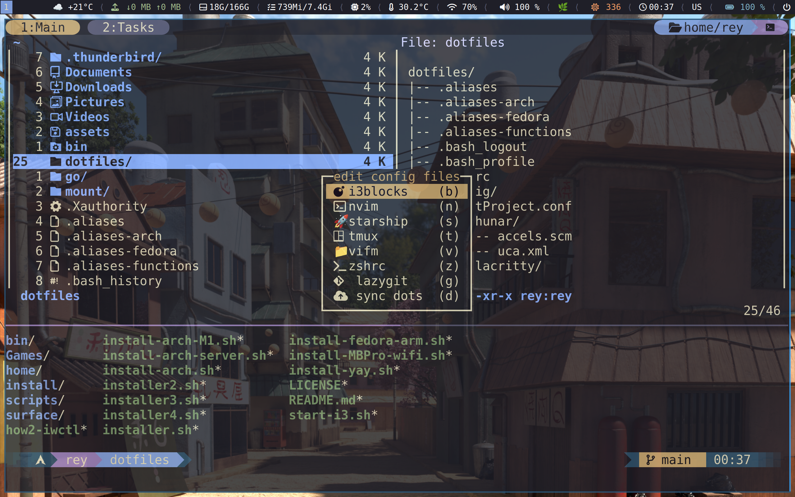

<h1 align="center" style="display: flex; justify-content: center; align-items: center;">

<br>
ArchLinux & Fedora Universal Installer for a Lightweight & Beautiful Setup
<br>
</h1>

### 🖥️ Automatic Installation:
```bash
bash <(curl -sSL https://kutt.it/ReyDot)
```


# Blazing Fast Theme Switcher

A simple, efficient, and centralized theme management system for your dotfiles and applications.

---

## Overview

With this setup, you define all your themes **once** inside your dotfiles. Then, using a small script, you can switch themes across all your applications **instantly**.

The magic? **Symlinks.** Instead of moving files or copying themes around, the script updates a single symlink pointing to the currently active theme folder. All your apps source their color schemes from that symlink, making theme switching:

- **Blazing fast**
- **Safe** (no file duplication or accidental overwrites)
- **Centralized** (one place to manage all themes)

---

## Features

- Centralized theme definitions in your dotfiles
- Instant theme switching across all apps
- Minimal disk operations (symlink only)
- Compatible with Nvim, Wofi, multiple Terminals, Tmux, Starship and other tools that read theme files

---

## Installation

Clone your dotfiles and make sure the scripts and themes are in place:

```bash
# Example directory structure
~/.dotfiles/
├── install-themes.sh
├── themes/
│   ├── theme1/
│   ├── theme2/
│   └── ...
└── .local/bin/rofi/wofi-theme-switcher
```

## 🚀 Great performance for x86 and Apple Silicon M1
  
This setup with Sway WM idles at ~600MB RAM with our ultra-efficient stack:  

✓ **C/Rust-powered tools**

✓ **Asahi Linux**-tuned kernel

✓ **Battery-optimized** power profiles  

**Why it flies:**  
- Zero Electron apps  
- GPU-optimized compositing  
- Minimal background services  

## 🌟 Features

- **Cross-Platform Compatibility**: Works on:
  - All standard x86_64 PCs
  - Apple Silicon (M1/M2) via Asahi Linux
  - Microsoft Surface devices
  - Various consumer laptops (HP, Dell, Lenovo, etc.)
- **Modular Design**: Select only the packages you need
- **Proven Stability**: Successfully installed on:
  - MacBook Air M1 (8GB)
  - MacBook Pro (Intel)
  - Microsoft Surface Pro 2
  - Various friends/family devices
- **Included Fixes**: Hardware-specific solutions in `/fixes` directory

## 🛠️ Tested Configurations

| Device | Status | Notes |
|--------|--------|-------|
| MacBook Air M1 (8GB) | ✅ Fully Working | Includes Asahi fixes |
| Microsoft Surface Pro 2 | ✅ Fully Working | Touchscreen support |
| Generic Intel Laptops | ✅ Fully Working | Broad compatibility |

# Core System
- **Shell:** `zsh` & `bash`
- **Kernel:** Linux 6.14.8-asahi-1-1-ARCH





## Window Managers

### Sway Ecosystem
| Component | Description | Language |
|-----------|-------------|------------
| [Sway](https://github.com/swaywm/sway) | Window Manager | ![C][c] |
| [Swaybg](https://github.com/swaywm/swaybg) | Wallpaper manager | ![C][c] |
| [Swaylock](https://github.com/swaywm/swaylock) | Screen locker | ![C][c] |
| [Swayidle](https://github.com/swaywm/swayidle) | Idle management | ![C][c] |
| [i3blocks](https://github.com/vivien/i3blocks) | Status Bar for Sway/i3 | ![C][c] |


### System Components
| Component | Description | Language |
|-----------|-------------|-----------|
| [Tmux](https://github.com/tmux/tmux) | Terminal Multiplexer | ![C][c] |
| [Starship](https://github.com/starship/starship) | Cross-Shell Prompt | ![Rust][rust] |
| [Dunst](https://dunst-project.org/) | Notification Daemon | ![C][c] |
| [Rofi-Wayland](https://gitlab.com/dgirault/wofi) | Application Launcher | ![C][c] |
| [wlr-randr](https://sr.ht/~emersion/wlr-randr/) | Display Output Manager| ![C][c] |


### Applications
| Component | Description | Language |
|-----------|-------------|-----------|
| [Autotiling-rs](https://github.com/nwg-piotr/autotiling-rs) | Auto-Tiling Script for Sway/Hyprland | ![Rust][rust] |
| [Bob](https://github.com/MordechaiHadad/bob) | Neovim Version Manager (Nightly Installer) | ![Rust][rust] |
| [Brave Browser](https://brave.com) | Web Browser | ![JavaScript][js] |
| [Btop](https://github.com/aristocratos/btop) | System Monitor | ![C++][cpp] |
| [Fastfetch](https://github.com/fastfetch-cli/fastfetch) | System Information Tool | ![C][c] |
| [Foot](https://codeberg.org/dnkl/foot) | Terminal Emulator | ![C][c] |
| [Fuzzel](https://codeberg.org/dnkl/fuzzel) | Wayland Application Launcher | ![C][c] |
| [fzf-preview](https://github.com/yuki-yano/fzf-preview.vim) | Fuzzy Finder Preview Plugin | ![TypeScript][ts] |
| [Lazygit](https://github.com/jesseduffield/lazygit) | Git TUI Client | ![Go][go] |
| [Librewolf](https://librewolf.net/) | Privacy-Focused Firefox Fork | ![C++][cpp] |
| [Neovim](https://neovim.io/) | Text Editor | ![C][c] |
| [nvim-nightly](https://github.com/neovim/neovim) | Nightly Build of Neovim | ![C][c] |
| [Satty](https://github.com/gabm/satty) | Screenshot Annotation Tool | ![Rust][rust] |
| [Swappy](https://github.com/jtheoof/swappy) | Wayland Screenshot Editor | ![C][c] |
| [Thunar](https://docs.xfce.org/xfce/thunar/start) | File Manager | ![C][c] |
| [Vifm](https://vifm.info/) | Terminal File Manager | ![C][c] |
| [Zathura](https://github.com/pwmt/zathura) | PDF Reader | ![C][c] |


### Gaming
| Component | Description | Language |
|-----------|-------------|-----------|
| [Steam](https://store.steampowered.com/) | Game Distribution Platform | ![C++][cpp] |
| [AntimicroX](https://github.com/AntiMicroX/antimicrox) | Gamepad to Keyboard/Mouse Mapper | ![C++][cpp] |
---


### 🖥️ Manual Installation Experience

**For best visual experience install FZF:**
```bash
git clone https://github.com/Rouzihiro/dotfiles.git
cd dotfiles
chmod +x install-arch.sh
chmod +x install-fedora.sh
chmod +x install-themes.sh
./installer-arch.sh
./install-fedora.sh
./install-themes.sh
```
### 🌈 Customization

    Edit package lists in /pkgs directory

    Add your fixes to /fixes (see existing examples)

    Select packages interactively during installation


### several Shell Enhanced Functions

---

<!-- Badge Definitions -->
[rust]: https://img.shields.io/badge/-Rust-DEA584?logo=rust&logoColor=black
[nim]: https://img.shields.io/badge/-nim-%23ffe953
[sh]: https://img.shields.io/badge/-shell-green
[go]: https://img.shields.io/badge/-go-68D7E2
[cpp]: https://img.shields.io/badge/-c%2B%2B-red
[c]: https://img.shields.io/badge/-c-lightgrey
[z]: https://img.shields.io/badge/-zig-yellow
[va]: https://img.shields.io/badge/-vala-blueviolet
[da]: https://img.shields.io/badge/-dart-02D3B3
[py]: https://img.shields.io/badge/-python-blue
[ts]: https://img.shields.io/badge/-TS-007BCD
[js]: https://img.shields.io/badge/-javascript-F7DF1E
[go]: https://img.shields.io/badge/-go-68D7E2
[nix]: https://img.shields.io/badge/-nix-7e7eff
